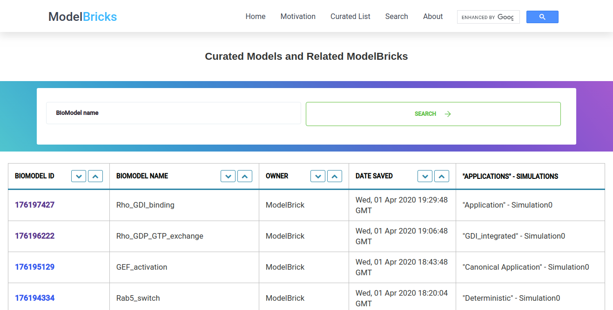
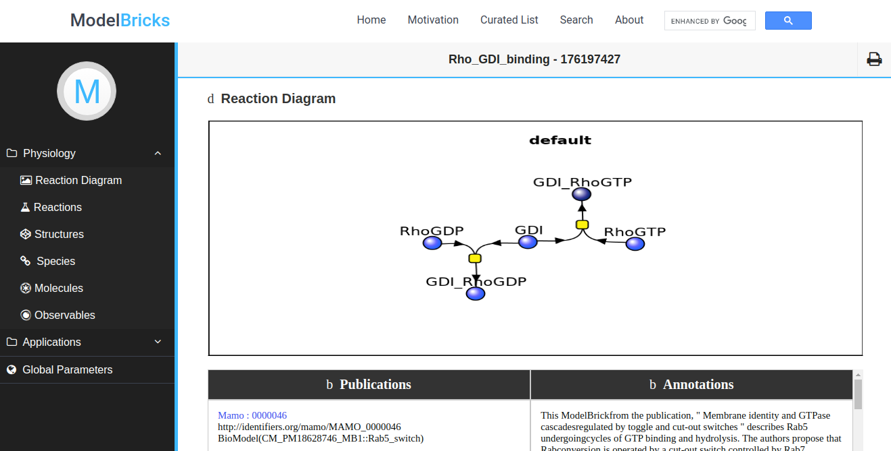
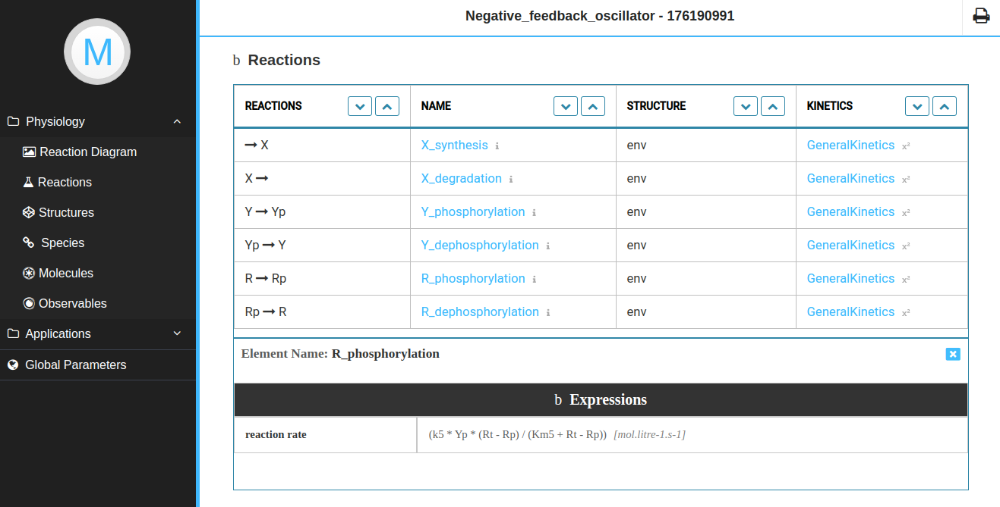
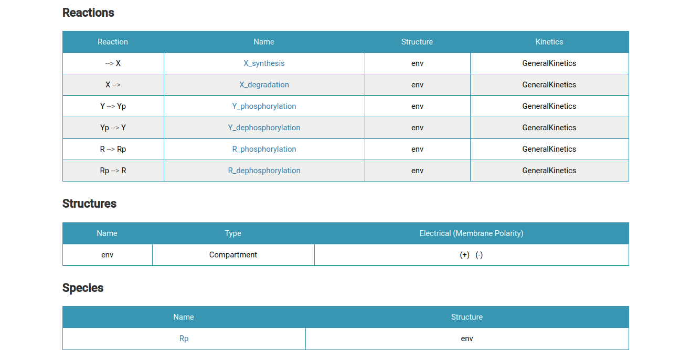
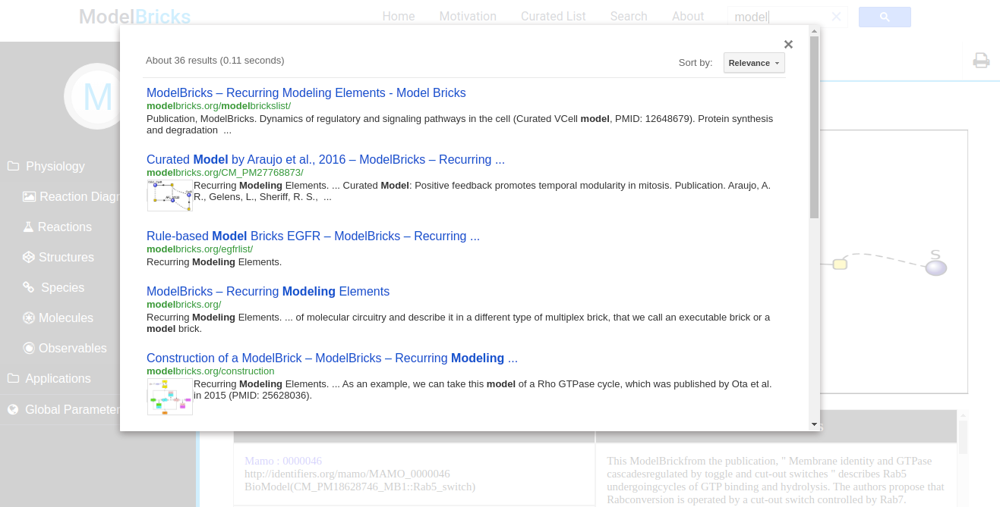

    
    <h2>
Redevelop Model Bricks code base architecture @ <a href="https://github.com/nrnb">NRNB</a> 
    </h2>

	<a href="#project-overview">Project Overview</a> | 
	<a href="#objectives">Objectives</a> | 
	<a href="#updates">Updates</a> | 
	<a href="#to-do">To Do</a> |
	<a href="#project-screenshots ">Project Screenshots</a> |
	<a href="#links">Links</a>

<!-- 

	Check out my <a href="https://medium.com/stray-stream/">blog</a> or follow me on <a href="https://twitter.com/sjha2048">Twitter</a> for more updates.

 -->
 

## Project Overview

VCell ​ is an open-source software platform that can model and simulate
reaction-diffusion systems in geometries derived from 3D experimental
microscopy images. VCell can also utilize experimentally derived molecular
concentrations and cellular localizations.
Model Bricks project is an initiative focused on describing recurring patterns in
biological networks t​ hat correspond to such biological concepts as a metabolic
reaction, catalysis, inhibition, protein phosphorylation, complex formation,
transcription, translation, etc.
These patterns are described as small ​ VCell models that are retrieved from the
VCell database by using VCell APIs and displayed online.
Currently, Model Bricks describe patterns for specific biological networks. It was
built on ​ YAML ​ data-serialization language and uses markdown (.md) files for
managing the content of the website. Back then, these technologies were cutting
edge of web development, the basis of their already-successful templating
feature, and the day-to-day support they got from the community. 

But now, these technologies are outshined by new better technologies. The
majority of developers have shifted to these new technologies for betterment in
terms of performance, simplicity, size, and flexibility and hence YAML and
Markdown files have faded away from the world of web development.
Therefore, one of the major aims of this project was to rebuild the entire
ModelBricks website using new superior technologies and using their capabilities
to further improve the quality of the codebase architecture and the overall
functionality.  
VCell is used by scientists around the world to create quantitative hypotheses of
cellular functions whose predictions can be directly compared to experimental
results, therefore, developed Modelbricks will encourage the use of recurring
patterns and help many in Computational and Network Biology.

**Mentors**: Ann Cowan, [Michael Blinov](https://github.com/vcellmike), [Frank Morgan](https://github.com/pepe454) and Dan Vasilescu

## Objectives

- Redesign and enhance the user interface according to the new
  modern trends.
- Create a web architecture that will allow displaying of as many
  VCell elements as possible, without being too crowded and easily
  accessible for each.
- Developing a pipeline that converts VCML(xml) data of each model into JSON data.
- Developing User Dashboard to display all the information of a BioModel.
- Create VCell API for each element to be displayed.
- Integrate Google Search, to search within the site.
- Automated creation of static html pages to enable google search.
- Create a Printable Model Page for each model.
- Automatic deployment using Herokuapp.
- Writing detailed ​ documentation of the project, to make the
  codebase simpler for other contributors.

## Main Repository URL

[ModelBricks_source](https://github.com/sraghuvanshi/ModelBricks_source)

## Updates

### Community Bonding (May 5, 2020 - June 1, 2020)

- Understood the codebase and VCell API’s generation process.
- Got familiar with the VCell application.
- Discussed detailed workflow with mentors along with implementation ideas.
- Agreed on changing the codebase language from Vue.js to Node.js and Handlebars.

### Phase One (June 1, 2020 - June 30, 2020)

- Developed web architecture.
- Converted VCML (xml) data to JSON data.
- Developed a basic Dashboard page.
- Developed static web pages for google search.
- Enable search​ in Model bricks and browsing using multiple filters.

### Phase Two (July 1, 2020 - July 31, 2020)

- Tested VCell API’s for a few elements.
- Created Curated List, that is connected to Vcell Beta API.
- Developing Components to receive data from the API’s.
- Injected JSON data and testing dynamic web pages.
- Integrated Google Search.
- Developed Printable pages for all BioModels.

### Phase Three (July 1, 2020 - August 24, 2020)

- Incorporated further feedback by mentors.
- Enhanced Model Dashboard page to enhance the stability.
- Displayed Annotations and universal ID's for each element.

## Deliverables

|           Tasks           |      Planned      |     Completed      |
| :-----------------------: | :---------------: | :----------------: |
| New Codebase Architecture |        Yes        | :heavy_check_mark: |
|    Convert XML to JSON    |        No         | :heavy_check_mark: |
|    BioModel Dashboard     |        Yes        | :heavy_check_mark: |
|  BioModel Printable Page  |        No         | :heavy_check_mark: |
|  Integrate Google Search  |        Yes        | :heavy_check_mark: |
| Automatic static webpages |        No         | :heavy_check_mark: |
|   Annotaions and UID's    | Yes (In Progress) |  :no_entry_sign:   |
|       Documentation       | Yes (In Progress) |  :no_entry_sign:   |

## To Do:

- Deploy this project to Modelbricks.org.
- Place annotations and UIDs right below the elements name in printable page.
- Create informative static web pages. (Future Scope)
- Develope automatic vcml file download system at set interval of time or by running a single. (Future Scope)
- Optimize the platform for mobile. (Future Scope)

## Links

- [Website Link](https://modelbricks.herokuapp.com/curatedList)
- [Github Repository](https://github.com/sraghuvanshi/ModelBricks_source)
- [Project Link](https://summerofcode.withgoogle.com/projects/#6674429192437760) on GSoC Website.

## Key Learnings

- Explored Node.js and got to know about it's various capabilities.
- Major concepts of Javascript
- Got to understand functionalities of a Templating Engine - Handlebars.
- Imporoved my collaboration and communication skills
- Gained major insight of a complete software development lifecycle.

## Project Screenshots

[Visit Website](https://modelbricks.herokuapp.com/curatedList)

 

 

 

 

 

## Footnotes

- We met twice every week over Zoom call on every Tuesday and Friday at 10:30am (EST)
- Great exprience with the amazing mentors - Ann Cowan and Michael Blinov. You guys are the best mentors that I could ever asked for. Thank for all the guidance and support.
- Project was constantly supervised by mentors and their feedbacks where Incorporated on time.
